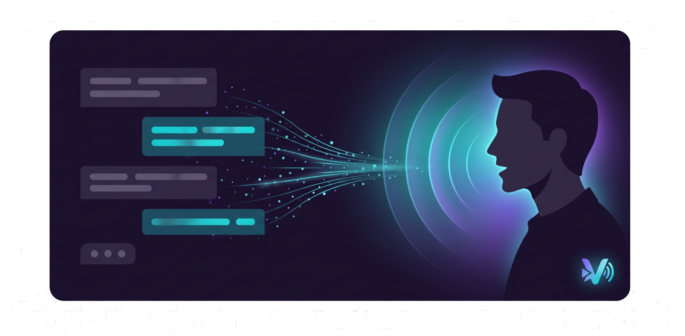

# Vocari

🇷🇺 [Русская версия](README.ru.md)

<p align="center"></p>

Turns a set of PNG layers into a talking 2D character for streaming: a transparent overlay (for OBS capture) that jumps onto the scene to speak a `!tts <text>` command from Twitch chat, opening its mouth and blinking in sync with the speech, then jumps back off — and if several messages arrive back to back, the stage shows a queue of several character copies at once.

<p align="center"></p>

## Installation

**[Download the Windows installer](https://github.com/sirdimitry/Vocari/releases/tag/latest)** — a permanent link that always points at the latest build. Download `VocariSetup-X.Y.Z.exe` and run it. The installer:
- installs the app into `%LOCALAPPDATA%\Programs\Vocari` — **no administrator rights, no UAC** (same as VS Code/Discord);
- silently installs the Microsoft Visual C++ Redistributable if it's missing (the one step where Windows asks for confirmation once — it's a system component, python312.dll won't start without it, but it's already present on most machines anyway);
- creates Start Menu and desktop shortcuts, and a proper uninstall entry under "Add or remove programs".

If you still get an error after installing, your antivirus most likely deleted or quarantined files under `_internal\` (unsigned PyInstaller builds sometimes trigger false positives) — check its quarantine/log and add the folder to exclusions.

Want to run from source or build it yourself — see "For developers" below.

### EndeavourOS / Arch Linux

Vocari builds as a native pacman package on EndeavourOS:

```bash
sudo pacman -S --needed base-devel python python-pip portaudio libsndfile libx11 libxext libxcb xcb-util-cursor xorg-xwayland
bash linux/build_endeavouros.sh
sudo pacman -U dist/linux/vocari-bin-*-x86_64.pkg.tar.zst
```

The package installs the application under `/opt/vocari`, the `vocari` command under `/usr/bin`, and a desktop entry under Audio & Video. Settings, imported models, and downloaded voices live in `$XDG_DATA_HOME/vocari` (normally `~/.local/share/vocari`), so the system installation remains read-only.

Under KDE Plasma Wayland, the `vocari` launcher automatically selects XWayland. This provides reliable transparency, click-through behavior, the global skip hotkey, and OBS "Window Capture (Xcomposite)". Set `VOCARI_NATIVE_WAYLAND=1 vocari` to opt into native Wayland; use PipeWire capture in OBS, and expect the global hotkey to be unavailable because of Wayland's security model.

Edge TTS and Piper work in the packaged Linux build. Automatic PyTorch download for Silero is currently Windows-only; source runs can use Silero when PyTorch is installed in the same Python environment before launch.

## How to use it

- Dragging the window: hold the left mouse button and drag the avatar (not the window's left edge — the window is wider than the visible character, see the OBS note below).
- Scale: mouse wheel.
- It blinks on its own (randomly every 2–6 s); the ahoge sways in an arc from its base like a real strand of hair; the ears, when the avatar bounces, rotate from the attachment point with a little lag (the edge near the head moves immediately, the tip catches up a beat later by inertia); and the whole figure (body, head, hair, ears) gently bobs up and down while idle and bounces more noticeably while speaking — also automatic (toggled off with the "Покачивание"/Sway switch in settings).
- **The avatar is hidden until someone writes `!tts`.** On command it jumps in from the left to its X/Y position (set by dragging or in the "Model" tab) — the jump's duration naturally covers the TTS synthesis delay (especially noticeable with Silero on first use), then it speaks, holds the pose for 1 second, mirrors horizontally and jumps back off the left edge — always, even if it was the only message. If messages arrive one after another, new copies jump in and queue up to the left of whoever's already speaking (up to 6 waiting + 1 speaking = 7 on stage at once; beyond that, they simply wait their turn with no visible copy yet). Every copy on stage blinks and sways on its own random rhythm — not in sync with the others.

**How the queue works.** Stage positions, front to back:

| position | who's there |
|---|---|
| 1 | the speaker, 100% size |
| 2 | always empty — a gap separating the speaker from the queue |
| 3…8 | the queue itself, packed with no gaps: 90%, 85%, 80%, 75%, 70%, 65% |

So up to 7 avatars are visible at once (the speaker + 6 queued). Once the speaker finishes and leaves, **the whole queue steps forward**: the nearest one in line takes the speaker's spot, everyone else shifts up one position and grows slightly. Messages beyond seven wait in an invisible backlog and join the tail of the queue as soon as a spot frees up — the queue always stays packed, newcomers never cut in line.

Configure the backlog in Settings → TTS: 1–1000 messages, default 30. This limits simultaneous waiting, not the total messages per stream. Changes apply immediately; lowering the limit preserves accepted messages. New messages are rejected when the backlog is full. Messages may wait up to two minutes from acceptance before synthesis begins, including time in the backlog and on stage. Expired messages are skipped; speech already underway continues. Rejections and expiration are recorded in the log.

**The speech bubble.** While the avatar talks, a bubble with the sender's nickname and the message itself hovers above it. The order is strict: the avatar arrives → the bubble rises → the speech plays → the bubble disappears → only then does the avatar mirror and leave. The bubble's size adapts to the text: a short message gets a compact bubble, a long one wraps across 2–4 lines, and if it still doesn't fit, the font size smoothly shrinks to keep the text inside. Configurable on the "Облачко"/Bubble tab: five built-in shapes (cloud, rounded rectangle, oval, glass, banner) or your own PNG (9-slice stretched), background/outline colors, size, appearance speed, separate font/size/color for the message and the nickname, and position relative to the avatar. The same tab has a test field: type a nickname and text (a rhyme is filled in by default) and click "Тест"/Test — the avatar comes out and delivers that message for real.

### Capturing in OBS

1. Source → **"Window Capture"**.
2. In the "Window" list pick **`[python.exe]: Vocari - <model>`** (or `[Vocari.exe]: …` for a built copy).
3. **"Capture Method" → "Windows 10 (1903 and later)"** — this is required. The window is transparent (layered), and the old BitBlt method can't capture windows like that: the source would stay blank. "Automatic" often picks BitBlt too.

The window is deliberately **not** marked as a tool window: that flag used to hide Vocari from OBS's window list entirely. The side effect is it's now visible in the taskbar and Alt-Tab, which also helps you find it if it gets buried under other windows.

- The window is deliberately borderless with no close button — so OBS Window Capture only picks up the avatar(s), no title bar or edges. **The window is now noticeably wider than the character itself** (room on the left for a queue of up to 7 plus space for entering/exiting off-frame) — if you crop the source to the character's size in OBS, don't crop it too tight, or the entrance/queue won't be visible on stream. Controlled through the system tray icon (the "V" icon):
  - double-click the icon, or the "Скрыть/Показать аватар" (Show/hide avatar) item — toggles visibility (regardless of whether it's currently speaking);
  - "Настройки…" (Settings…) — a settings window with tabs:
    - "Рендер" (Render) — the "Поверх всех окон" (Always on top) switch (turn it off if you want to open a game or another app on top of the avatar on your own screen — doesn't affect OBS Window Capture, which grabs the window's contents by handle, not by screen area), a GPU (RTX) / CPU switch (for now it only saves the choice, an actual GPU backend is still ahead), and a "Покачивание" (Sway) switch (the ahoge arc, ears with lag, idle background sway, body bounce while speaking);
    - "Модель" (Model) — a "Выбрать папку со своей моделью…" (Choose a folder with your own model…) button (see below), next to it a "Порядок слоёв…" (Layer order…) button (a large avatar preview on a black background on the left, a list of layers on the right — drag with the mouse to change the bottom-to-top draw order, the layer selected in the list glows blue on the preview; "Как было"/"По номерам" (As it was / By number) buttons reset the order), plus exact X/Y/scale fields for the overlay — the same coordinates as the speaker's position on stage (dragging and scrolling on the avatar itself do the same thing), with an "Применить" (Apply) button. Random mode uses only checked models; when none are checked, the current active avatar is used;
    - "Ники" (Nicknames) — pin a specific avatar to a specific chat nickname: messages from a pinned nickname are always voiced by that avatar, regardless of whether "Случайный аватар" (Random avatar) is on in "Модель" — unpinned (anonymous) senders still get the usual random pick. The nickname list fills itself in as soon as someone writes `!tts` in Twitch chat — you can pin them right away, mid-stream, no restart needed; or add a nickname by hand ahead of time. Automatic history is limited to the latest 200 nicknames, while nicknames with an assigned model are retained. The same tab has "Шанс появления в случайном режиме" (Odds of showing up in random mode): a 0–300% slider per model (100% — an equal share with everyone else, 0% — doesn't take part in random selection, but is still available for a manual nickname pin); if every selected model has a 0% weight, the active avatar is used. Model lists and weights update when a model is imported or deleted, and a deleted model's pins and weights are cleared automatically;
    - "TTS" — choice of voice engine (Edge TTS / Silero / Piper), a separate voice for RU and EN (for Edge, any voice name can be typed in manually; for Silero and Piper, a list of the selected language's downloaded voices), speech rate (Silero and Piper don't support it and the field is disabled in that mode), volume, text length limit, an auto-detect-language switch (and manual language choice when it's off), a "Случайный голос" (Random voice) switch — when on, every phrase is voiced by a random voice from the selected engine's set;
    - "Silero" — if torch hasn't been downloaded yet (see below), instead of the preload buttons there's a "Скачать офлайн-голоса" (Download offline voices) button (~160 MB, one time) with progress and a prompt to restart Vocari once it's done; after that it works as usual — preloading the offline model (separately for RU and EN): without it, the first message has a delay (download + model warm-up), after preloading it's nearly instant. Runs strictly on CPU and uses at most four threads, leaving capacity for the game and OBS. Models download into `silero_cache/` in the project root (not the user's home folder) — that folder is in `.gitignore`, it won't end up in git;
    - "Piper" — a second offline engine, lighter and faster than Silero (no PyTorch, just a small ONNX runtime bundled inside Piper's own release, ~25 MB) — download the engine once, then any RU/EN voices you want (~60 MB each) from a small built-in catalog; a voice is ready only when both its `.onnx` and `.onnx.json` files exist and pass verification, while incomplete or corrupt voices can be downloaded again; everything lands in `runtime_deps/` next to Vocari, same as Silero's dependencies, and stays out of git;
    - "Twitch" — channel, OAuth token (with a button that opens the token page and a step-by-step guide), a "Подключиться к чату" (Connect to chat) button with connection status, the trigger command, cooldown, access by subscriber/VIP/moderator status, a word blacklist.
  - "Лог…" (Log…) — a separate window with the app's log, terminal-styled (black background): normal messages in white, warnings in yellow, errors in red. Scrollable; "Очистить" (Clear) wipes both the view and the `logs/vocari.log` file; "Закрыть" (Close) minimizes the window (doesn't end the process); the log file resets itself once it reaches 10 MB;
  - "Выход" (Exit) — closes the app (saves position/scale to `config.json`).
  - Escape also hides the avatar window (doesn't close the whole app).

Position, scale, and model path are saved to `config.json` in the project root between runs. The file is encrypted with Windows DPAPI (tied to the current Windows account on this machine) — it's not readable plain JSON but binary data, so it can't be opened and hand-edited in Notepad (see `vocari/config/dpapi.py`).

Saving uses an encrypted temporary file and atomic replacement. The previous valid settings are kept in an encrypted `config.json.bak` backup (the first save backs up the initial settings). If the main file is missing or corrupt, the app automatically loads the backup and records the recovery in the log. A write failure displays a settings-not-saved message.

Downloaded Piper/Silero components and models are checked against pinned SHA-256 hashes before use. A corrupt or replaced file is never loaded as executable code; see [`docs/download-integrity.md`](docs/download-integrity.md) for details.

**On speech latency:** edge-tts is a cloud service (Microsoft Edge's free neural voices), not a local model — every synthesis is a request over the internet, hence a roughly 1–3 s delay before playback starts. Silero (the "Silero" settings tab) is a free offline provider: after preloading, synthesis runs on the CPU with no network and noticeably faster (in testing, a fraction of a second for a short phrase once warmed up).

## For developers

Running from source instead of the installer — e.g. to change something in the code.

```powershell
py -3.12 -m venv .venv
.\.venv\Scripts\pip install -r requirements.txt
```

Silero (the offline TTS provider) also needs `torch` — it's deliberately not in `requirements.txt`, because `pip install torch` installs a huge CUDA (NVIDIA) build by default on Windows even on machines with no graphics card at all. Install the CPU build explicitly instead (works the same on any hardware — Intel/AMD, with any graphics card or none):

```powershell
.\.venv\Scripts\pip install torch --index-url https://download.pytorch.org/whl/cpu
```

Without this step the app still starts and runs — only Edge TTS will be available in TTS settings, and the Silero tab will offer a "Download offline voices" button instead of a voice list (see "Building the .exe" below — the same thing happens automatically there, no manual pip install needed, and it's the only way to get Silero in the packaged `.exe`).

Run it:

```powershell
.\.venv\Scripts\python.exe -m vocari.main
```

### Building the .exe

```powershell
.\.venv\Scripts\pip install -r requirements-dev.txt
.\.venv\Scripts\pyinstaller.exe vocari.spec --noconfirm
mkdir dist\Vocari\assets\branding
xcopy /E /I assets\models dist\Vocari\assets\models
copy assets\branding\icon.ico dist\Vocari\assets\branding\icon.ico
copy assets\branding\icon.png dist\Vocari\assets\branding\icon.png
```

The result is a `dist\Vocari\` folder (not a single file: `--onedir`, not `--onefile`) with `Vocari.exe` and a supporting `_internal\`. The whole folder can be moved/archived and handed out as-is — `config.json`, `logs\`, and `silero_cache\` are created next to `Vocari.exe` on first run, exactly like next to the script when running from source (see `vocari/paths.py`), and never end up inside the build itself.

torch (and Silero with it) is deliberately **excluded** from the build (`excludes` in `vocari.spec`) — even if it's installed in your dev `.venv`, it won't make it into the `.exe`: ~600 MB is a cost every user would pay, even the ones who never touch Silero. Instead, the Silero settings tab downloads a prebuilt CPU torch build on demand (the "Download offline voices" button, ~160 MB) from the `runtime-deps-torch-cpu-v1` release of this same GitHub repo — see `vocari/runtime_deps.py`. It downloads once into `runtime_deps\` next to `Vocari.exe` (also in `.gitignore`), after which the app asks to be restarted — from then on Silero works fully offline, with no further network calls.

The bundled avatar models and the two application icons aren't embedded into the build by PyInstaller — they're copied alongside as plain files, so importing your own models (Settings → Model) can keep writing new folders there, same as when running from source. The GitHub banner is documentation artwork and is deliberately left out of the application and installer.

Downloaded Silero language models are detected in both the current and legacy cache layouts on every startup, verified, and loaded from disk automatically. This startup check never downloads replacement files: damaged models show an error and can be downloaded again explicitly. Piper checks all catalog voices and distinguishes missing, incomplete, and damaged files. An existing engine that needs updating is shown separately from a missing engine.

### Building the installer

The plain `dist\Vocari\` folder can just be zipped up and handed out — but **it may fail to start on someone else's machine** with an error like:

```
Failed to load Python DLL '...\_internal\python312.dll'.
LoadLibrary: The specified module could not be found.
```

That means the **Microsoft Visual C++ Redistributable (x64)** is missing on that machine — `python312.dll` itself depends on it, and the app won't start at all without it. It's almost always already present on a developer's machine (Visual Studio, Python, plenty of games install it), so the problem only shows up for "clean" users.

The installer handles this automatically: it checks the registry for the redistributable and silently installs it, only if it's missing.

```powershell
winget install JRSoftware.InnoSetup          # one time
curl -L -o installer\vc_redist.x64.exe https://aka.ms/vs/17/release/vc_redist.x64.exe   # one time, ~25 MB
.\.venv\Scripts\python.exe installer\build_installer.py
```

The result is `installer\output\VocariSetup-X.Y.Z.exe` (a single file, ~70 MB) — that's what you hand out. It:
- installs the app into `%LOCALAPPDATA%\Programs\Vocari` — **no administrator rights, no UAC** (same as VS Code/Discord), and `config.json`/`logs`/`silero_cache` are written there without issue;
- installs the VC++ Redistributable if needed (this is the one step where Windows will ask for confirmation once — it's a system component, there's no way around that);
- creates Start Menu and desktop shortcuts, and a proper uninstall through "Add or remove programs".

If a client still gets the error even after installing via `VocariSetup` — their antivirus most likely deleted or quarantined files under `_internal\` (unsigned PyInstaller builds often trigger false positives). Have them check the antivirus log/quarantine and add the folder to exclusions.

## Twitch bot

On the "Twitch" tab, enter the channel and OAuth token, click "Подключиться к чату" (Connect to chat). From there the bot:
1. Listens to the channel's messages and only picks up ones starting with the trigger command (`!tts` by default, case-insensitive).
2. Checks access (subscribers/VIP/moderators — if no filter is on, everyone has access), per-user cooldown, and a word blacklist — in that order; on the first mismatch the message is simply skipped (logged, no reply in chat).
3. Trims the text to the length limit (TTS tab) and queues it for speech — messages are spoken one at a time, in order, never interrupting each other, even if several viewers send the command at the same moment.

Runs on `twitchio` 2.x (classic token-based auth — see `requirements.txt` for why the version is pinned below 3.0) on top of the shared `vocari/chat/` abstraction — the command-handling code itself isn't tied to Twitch specifics, so a YouTube source could be added later by implementing the same `ChatSource` interface.

## Models

A model is a folder of PNG layers (all on one canvas of the same size) with a `model.json` manifest next to them. The manifest format and the exact semantics of each field are described in the docstring of [vocari/rendering/model.py](vocari/rendering/model.py). The current default model is `assets/models/Ariral`.

## Project layout

```
vocari/
  __version__.py — app version (see "Versioning")
  paths.py    — where config.json/logs/silero_cache/assets live — from source and from a built .exe (see "Building the .exe")
  hotkey.py   — the global skip-current-phrase hotkey (RegisterHotKey, works even without focus on the Vocari window)
  config/     — loading/saving settings (config.json)
  rendering/  — the avatar model (model.json), the transparent overlay window, the stage (stage.py — the queue of jumping-in copies), auto-import of your own models
  tts/        — TTSProviders (edge-tts, Silero), audio playback + RMS mouth sync, the speech queue, rhymes for testing the queue (poems.py)
  chat/       — the chat source abstraction (ChatMessage/ChatSource) + pure filters (cooldown, access, blacklist)
  twitch/     — the twitchio implementation of ChatSource + a background connection thread
  ui/         — the tray, the settings window (Render/Model/Bubble/Nicknames/TTS/Silero/Piper/Twitch), the log window, the on-screen position preview (screen_preview.py)
assets/
  models/     — folders of model PNG layers
run_vocari.py — the entry point for the build (see "Building the .exe")
vocari.spec   — PyInstaller configuration
installer/
  vocari.iss          — the Inno Setup script (see "Building the installer")
  build_installer.py  — fills in the version and calls the Inno Setup compiler
linux/             — pacman package builder, X11/XWayland launcher, and desktop file for EndeavourOS/Arch
```

## Hardware compatibility

The app should work the same on a powerful PC with an NVIDIA RTX card, on a weak laptop with no graphics card at all, and on AMD Radeon — viewers and streamers have all kinds of hardware. So:
- Silero TTS runs strictly on CPU (see `vocari/tts/silero_provider.py`) and uses at most four threads — CUDA only works on NVIDIA, and Silero is designed to run fast without a GPU anyway;
- torch is installed as an explicit CPU build (see "For developers") — it doesn't pull in CUDA dependencies that nobody but NVIDIA owners would use;
- model PNG layers load on demand and stay in a bounded LRU cache; an empty overlay stops its repaint timer completely;
- the avatar itself is rendered with plain software rendering via QPainter, with no tie to any particular GPU vendor.

## Versioning

The version lives in one place — [vocari/__version__.py](vocari/__version__.py) — and shows up in the tray tooltip and the settings window's title. The scheme is [semver](https://semver.org/) (`MAJOR.MINOR.PATCH`):
- **PATCH** — bug fixes with no new functionality;
- **MINOR** — a development stage or a noticeable feature is complete;
- **MAJOR** — after a stable release (v1.0), for breaking changes.

For significant changes, the version in `__version__.py` needs to be bumped by hand and, optionally, tagged with the matching git tag (`git tag vX.Y.Z`) on the release commit.

---

vibe-coded by — [@sirdimitry](https://github.com/sirdimitry)
