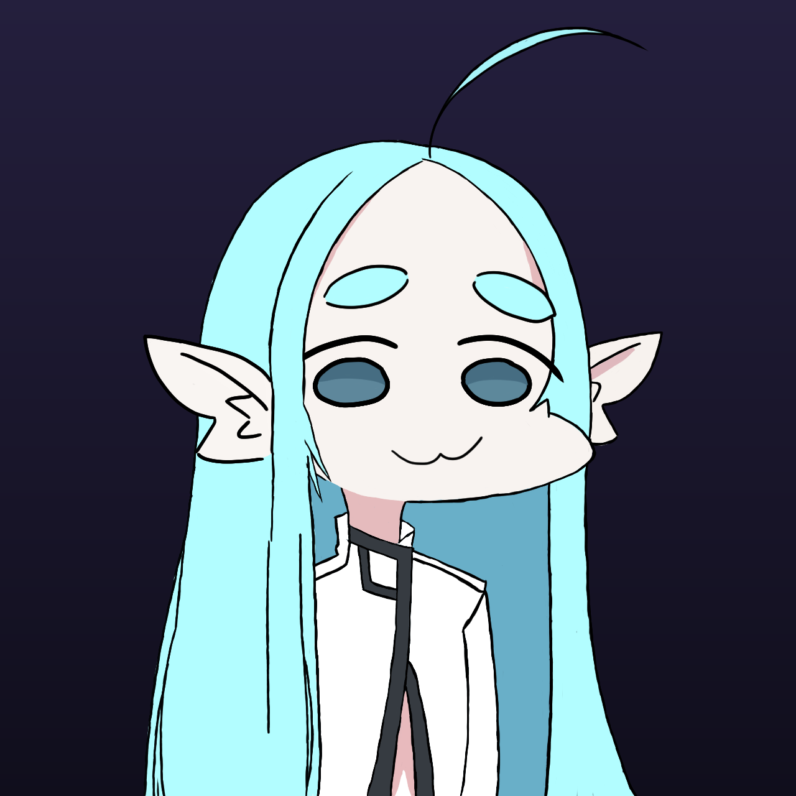

# Vocari

Оживляет набор PNG-слоёв в говорящего 2D-персонажа для стрима: прозрачный оверлей (для захвата в OBS), который выпрыгивает на сцену озвучить команду `!tts <текст>` из Twitch-чата, открывая рот и моргая синхронно с озвучкой, и упрыгивает обратно — а если сообщений несколько подряд, на сцене одновременно видно очередь из нескольких копий персонажа.

<p align="center"></p>

## Установка

```powershell
py -3.12 -m venv .venv
.\.venv\Scripts\pip install -r requirements.txt
```

Silero (офлайн TTS-провайдер) требует ещё и `torch` — он намеренно не в `requirements.txt`, потому что `pip install torch` по умолчанию на Windows ставит огромную сборку с поддержкой CUDA (NVIDIA) даже там, где видеокарты вообще нет. Ставьте CPU-сборку явно (работает одинаково на любом железе — Intel/AMD, с любой видеокартой или без неё):

```powershell
.\.venv\Scripts\pip install torch --index-url https://download.pytorch.org/whl/cpu
```

Без этого шага приложение всё равно запускается и работает — просто в настройках TTS будет доступен только Edge TTS, а выбор Silero покажет понятную ошибку с подсказкой поставить torch.

## Запуск

```powershell
.\.venv\Scripts\python.exe -m vocari.main
```

- Перетаскивание окна: зажать левую кнопку мыши и тащить аватар (не левый край окна — окно шире, чем видимый персонаж, см. ниже про OBS).
- Масштаб: колесо мыши.
- Моргает само (случайно раз в 2–6 сек); ахоге покачивается дугой от основания, как настоящая прядь волос; уши при подпрыгивании поворачиваются от точки крепления к голове с небольшим запаздыванием (край у головы движется сразу, кончик уха — по инерции чуть позже); а вся фигурка целиком (тело, голова, волосы, уши) слегка покачивается вверх-вниз в простое и заметнее подпрыгивает во время речи — тоже само (отключается тумблером "Покачивание" в настройках).
- **Аватар скрыт, пока никто не написал `!tts`.** По команде он выпрыгивает слева на позицию X/Y (заданную перетаскиванием или во вкладке "Модель") — пауза на время прыжка естественно маскирует задержку синтеза TTS (особенно заметную у Silero при первом запуске), затем говорит, держит позу 1 секунду, зеркалится по горизонтали и упрыгивает обратно за левый край — всегда, даже если сообщение было единственным. Если сообщения приходят одно за другим, новые копии выпрыгивают и встают в очередь левее уже говорящей (до 6 ожидающих + 1 говорящий = 7 одновременно на сцене; сверх этого — просто ждут своей очереди без видимой копии). Каждая копия на сцене моргает и покачивается в своём собственном, случайном ритме — не синхронно с остальными.

**Как устроена очередь.** Позиции на сцене, спереди назад:

| позиция | кто там |
|---|---|
| 1 | говорящий, 100% размера |
| 2 | всегда пустая — зазор, отделяющий говорящего от очереди |
| 3…8 | сама очередь, вплотную, без дырок: 90%, 85%, 80%, 75%, 70%, 65% |

Итого одновременно видно до 7 аватаров (говорящий + 6 в очереди). Когда говорящий договорил и уехал, **вся очередь шагает вперёд**: ближайший ожидающий встаёт на место говорящего, остальные подтягиваются на одну позицию и заодно немного подрастают. Сообщения сверх семи ждут в невидимом резерве и подъезжают в хвост очереди, как только освобождается место, — очередь всегда плотная, новички никогда не влезают вперёд.

### Захват в OBS

1. Источник → **«Захват окна»** (Window Capture).
2. В списке «Окно» выбрать **`[python.exe]: Vocari - <модель>`** (или `[Vocari.exe]: …` для собранной версии).
3. **«Метод захвата» → «Windows 10 (1903 и новее)»** — это обязательно. Окно прозрачное (layered), а старый метод BitBlt такие окна не умеет захватывать: источник останется пустым. «Автоматически» тоже часто выбирает BitBlt.

Окно намеренно **не** помечено как tool-window: именно этот флаг раньше полностью прятал Vocari из списка окон OBS. Побочный эффект — теперь оно видно в панели задач и Alt+Tab, что заодно помогает найти его, если потеряли за другими окнами.

- Окно намеренно без рамки и крестика — так OBS Window Capture захватывает только аватар(ов), без title bar и границ. **Окно теперь заметно шире самого персонажа** (запас слева под очередь из 7 копий плюс место для входа/выхода за кадр) — если в OBS обрезаете источник по размеру персонажа, не обрезайте слишком туго, иначе выезд/очередь будут не видны в трансляции. Управление — через иконку в системном трее (значок "V"):
  - двойной клик по иконке или пункт "Скрыть/Показать аватар" — переключить видимость (независимо от того, говорит ли он сейчас);
  - "Настройки…" — окно настроек с вкладками:
    - "Рендер" — тумблер "Поверх всех окон" (выключите, чтобы можно было открыть поверх аватара игру или другое приложение на своём экране — на запись через OBS Window Capture это не влияет, он берёт содержимое окна по хэндлу, а не по области экрана), тумблер GPU (RTX) / CPU (пока только сохраняет выбор, сам GPU-бэкенд впереди) и тумблер "Покачивание" (ахоге дугой, уши с запаздыванием, фоновое покачивание в простое, подпрыгивание тела при речи);
    - "Модель" — кнопка "Выбрать папку со своей моделью…" (см. ниже), плюс точные поля X/Y/масштаб оверлея — те же координаты, что и позиция говорящего на сцене (перетаскивание и колесо мыши на самом аватаре делают то же самое), с кнопкой "Применить";
    - "TTS" — выбор движка озвучки (Edge TTS / Silero), голос отдельно для RU и для EN (для Edge — можно ввести любой голос вручную; для Silero — список голосов выбранного языка), скорость речи (Silero её не поддерживает и в этом режиме поле выключается), громкость, лимит длины текста, тумблер автоопределения языка (и ручной выбор языка, когда он выключен), тумблер "Случайный голос" — при включении каждая фраза озвучивается случайным голосом из набора выбранного движка;
    - "Silero" — предзагрузка офлайн-модели (отдельно для RU и EN): без неё первое сообщение идёт с задержкой (скачивание + разогрев модели), после предзагрузки — почти мгновенно. Работает строго на CPU — одинаково на любой видеокарте или вообще без неё. Модели скачиваются в `silero_cache/` в корне проекта (не в домашнюю папку пользователя) — папка в `.gitignore`, не попадёт в git;
    - "Twitch" — канал, OAuth-токен (с кнопкой открытия страницы получения токена и пошаговой инструкцией), кнопка "Подключиться к чату" со статусом соединения, команда-триггер, кулдаун, доступ по подписке/VIP/модераторству, чёрный список слов;
    - "Тест" — поле для текста + кнопка "Озвучить": синтез через выбранный на вкладке TTS движок, проигрывание через sounddevice; рот переключается между 2 состояниями (открыт/закрыт, без плавного перехода — так и задумано) по порогу громкости, а подпрыгивание тела плавно следует за самой громкостью (громче/резче звук — резче скачок, тише — плавно оседает).
  - "Лог…" — отдельное окно с логом приложения в стиле терминала (чёрный фон): обычные сообщения белым, предупреждения жёлтым, ошибки красным. Скроллится, "Очистить" стирает и файл `logs/vocari.log`, "Закрыть" сворачивает окно (не завершает процесс); лог-файл сам обнуляется по достижении 10 МБ;
  - "Выход" — закрыть приложение (сохранит позицию/масштаб в `config.json`).
  - Escape тоже скрывает окно аватара (не закрывает приложение целиком).

Позиция, масштаб и путь к модели сохраняются в `config.json` в корне проекта между запусками.

**О задержке озвучки:** edge-tts — облачный сервис (бесплатные нейро-голоса Microsoft Edge), а не локальная модель — каждый синтез это запрос через интернет, отсюда задержка в районе 1–3 сек перед началом воспроизведения. Silero (вкладка "Silero" в настройках) — бесплатный офлайн-провайдер: после предзагрузки синтез идёт на CPU без сети и заметно быстрее (в тестах — доли секунды на короткую фразу после разогрева).

## Сборка .exe

```powershell
.\.venv\Scripts\pip install -r requirements-dev.txt
.\.venv\Scripts\pyinstaller.exe vocari.spec --noconfirm
xcopy /E /I assets dist\Vocari\assets
```

Результат — папка `dist\Vocari\` (не один файл: `--onedir`, не `--onefile`) с `Vocari.exe` и служебной `_internal\`. Эту папку целиком можно переносить/архивировать и раздавать — `config.json`, `logs\` и `silero_cache\` создаются рядом с `Vocari.exe` при первом запуске, точно так же, как рядом со скриптом при запуске из исходников (см. `vocari/paths.py`), и никогда не оказываются внутри сборки.

torch (а с ним и Silero) намеренно **исключён** из сборки (`excludes` в `vocari.spec`) — даже если он стоит в вашем `.venv` для разработки, в `.exe` он не попадёт: подключать его к уже собранному `.exe` нельзя, поэтому в упакованной версии Silero всегда покажет ошибку "не установлен" (Edge TTS работает как обычно). Хотите Silero — запускайте из исходников (см. "Установка").

Модель Ariral (`assets/`) в сборку через PyInstaller не встраивается — копируется рядом обычной папкой (`xcopy` выше), чтобы импорт своих моделей (Настройки → Модель) мог дописывать туда новые папки, как при запуске из исходников.

## Сборка установщика

Готовую папку `dist\Vocari\` можно просто заархивировать и отдать — но **на чужом компьютере она может не запуститься** с ошибкой вида:

```
Failed to load Python DLL '...\_internal\python312.dll'.
LoadLibrary: The specified module could not be found.
```

Это значит, что на той машине нет **Microsoft Visual C++ Redistributable (x64)** — от него зависит сам `python312.dll`, и без него приложение не стартует вообще. На машине разработчика он почти всегда уже стоит (его ставят Visual Studio, Python, куча игр), поэтому проблема видна только у "чистых" пользователей.

Установщик решает это автоматически: проверяет наличие редистрибутива в реестре и доустанавливает его молча, только если его нет.

```powershell
winget install JRSoftware.InnoSetup          # один раз
curl -L -o installer\vc_redist.x64.exe https://aka.ms/vs/17/release/vc_redist.x64.exe   # один раз, ~25 МБ
.\.venv\Scripts\python.exe installer\build_installer.py
```

Результат — `installer\output\VocariSetup-X.Y.Z.exe` (один файл, ~70 МБ), его и раздавайте. Он:
- ставит приложение в `%LOCALAPPDATA%\Programs\Vocari` — **без прав администратора и без UAC** (как VS Code/Discord), и туда же спокойно пишутся `config.json`/`logs`/`silero_cache`;
- при необходимости доустанавливает VC++ Redistributable (вот на этом шаге Windows один раз спросит подтверждение — редистрибутив системный, иначе никак);
- делает ярлыки в меню "Пуск" и на рабочем столе, и полноценную деинсталляцию через "Установка и удаление программ".

Если у клиента ошибка осталась даже после установки через `VocariSetup` — скорее всего его антивирус удалил или поместил в карантин файлы из `_internal\` (PyInstaller-сборки без цифровой подписи часто ловят ложные срабатывания). Пусть проверит журнал/карантин антивируса и добавит папку в исключения.

## Twitch-бот

Во вкладке "Twitch" укажите канал и OAuth-токен, нажмите "Подключиться к чату". Дальше бот сам:
1. Слушает сообщения канала и берёт только те, что начинаются с команды-триггера (по умолчанию `!tts`, регистр не важен).
2. Проверяет доступ (подписчики/VIP/модераторы — если ни один фильтр не включён, доступно всем), кулдаун на пользователя и чёрный список слов — в таком порядке, при первом несовпадении сообщение просто пропускается (в лог, без ответа в чат).
3. Обрезает текст по лимиту длины (вкладка TTS) и ставит в очередь озвучки — сообщения проговариваются по одному, по очереди, не перебивая друг друга, даже если несколько зрителей написали команду одновременно.

Работает через `twitchio` 2.x (классическая авторизация по токену — см. `requirements.txt`, почему версия зафиксирована ниже 3.0) поверх общей абстракции `vocari/chat/` — сам код обработки команд не завязан на Twitch-специфику, так что источник для YouTube можно будет добавить позже, реализовав тот же интерфейс `ChatSource`.

## Модели

Модель — это папка с PNG-слоями (все на одном холсте одинакового размера) и манифестом `model.json` рядом с ними. Формат манифеста и точная семантика полей описаны в docstring [vocari/rendering/model.py](vocari/rendering/model.py). Текущая модель по умолчанию — `assets/models/Ariral`.

## Структура проекта

```
vocari/
  __version__.py — версия приложения (см. "Версионирование")
  paths.py    — где лежат config.json/logs/silero_cache/assets — из исходников и из собранного .exe (см. "Сборка .exe")
  hotkey.py   — глобальный хоткей пропуска фразы (RegisterHotKey, работает даже без фокуса на окне Vocari)
  config/     — загрузка/сохранение настроек (config.json)
  rendering/  — модель аватара (model.json), прозрачное окно оверлея, сцена (stage.py — очередь выпрыгивающих копий), автоимпорт своих моделей
  tts/        — TTSProvider'ы (edge-tts, Silero), проигрывание звука + RMS-синхронизация рта, очередь озвучки, стишки для теста очереди (poems.py)
  chat/       — источник чата абстрактно (ChatMessage/ChatSource) + чистые фильтры (кулдаун, доступ, чёрный список)
  twitch/     — twitchio-реализация ChatSource + фоновый поток с подключением
  ui/         — трей, окно настроек (Рендер/Модель/TTS/Silero/Twitch/Тест), окно лога, превью позиции на экране (screen_preview.py)
assets/
  models/     — папки с PNG-слоями моделей
run_vocari.py — точка входа для сборки (см. "Сборка .exe")
vocari.spec   — конфигурация PyInstaller
installer/
  vocari.iss          — скрипт Inno Setup (см. "Сборка установщика")
  build_installer.py  — подставляет версию и вызывает компилятор Inno Setup
```

## Совместимость с разным железом

Приложение должно одинаково работать и на мощном ПК с NVIDIA RTX, и на слабом ноутбуке без видеокарты, и на AMD Radeon — у зрителей и стримеров оборудование разное. Поэтому:
- Silero TTS запускается строго на CPU (см. `vocari/tts/silero_provider.py`) — CUDA работает только на NVIDIA, а Silero и так спроектирован быстро работать без GPU;
- torch ставится CPU-сборкой явно (см. "Установка") — не тянет CUDA-зависимости, которые никто, кроме владельцев NVIDIA, не использует;
- будущий GPU-рендер аватара (тумблер в "Рендер") тоже будет на OpenGL, а не на чём-то NVIDIA-специфичном — тумблер и сейчас по умолчанию выключен (CPU-рендер).

## Версионирование

Версия хранится в одном месте — [vocari/__version__.py](vocari/__version__.py) — и отображается в тултипе трея и заголовке окна настроек. Схема — [semver](https://semver.org/) (`MAJOR.MINOR.PATCH`):
- **PATCH** — багфиксы без новой функциональности;
- **MINOR** — завершён очередной этап разработки или заметная фича;
- **MAJOR** — после стабильного релиза (v1.0), для несовместимых изменений.

При значимых изменениях версию в `__version__.py` нужно поднимать вручную и, по желанию, ставить git-тег того же номера (`git tag vX.Y.Z`) на коммите релиза.
